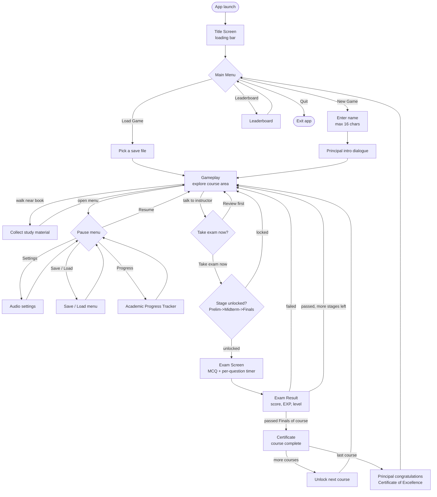

# Academia Heights — App / Game Flow

Text version of Figure 1 from the proposal. Keep in sync with the gameplay
and the navigation graph in `lib/routes.dart`.

## Decision points

| Decision | Options | Rule |
|---|---|---|
| Main Menu | New Game / Load Game / Leaderboard / Quit | — |
| After talking to instructor | Take the exam now / I will review first | Must have talked to the instructor to reach here |
| Exam gate | proceed / blocked | Midterm needs Prelim passed; Finals needs Midterm passed |
| Exam result | pass / fail | Pass mark is a named constant; fail loops back to exploring, no game over |
| Course complete | next course / game won | Finishing the last course triggers the ending |
